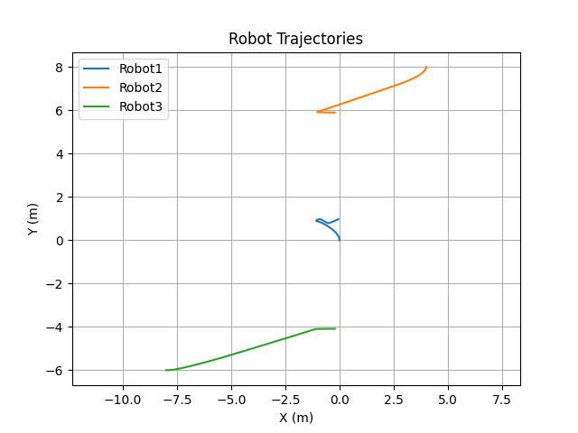
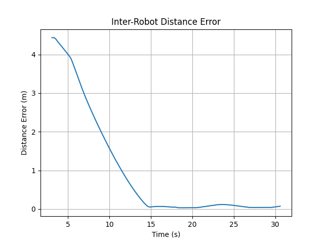
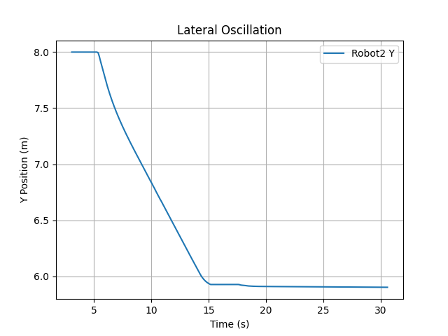

# 🤖 Swarm Robot System — ROS 2 Multi-Robot Coordination

A ROS 2–based multi-robot swarm coordination system simulated in Gazebo. Three differential-drive robots are spawned at arbitrary locations and coordinated using formation control and leader–follower behavior, driven by a shared multi-robot PID controller.

---

## 📸 Demo

> Three robots spawning at random positions and converging into a straight-line formation.


---

## ✨ Features

- **Formation Control** — Robots compute the swarm centroid and arrange into a straight-line formation from arbitrary initial positions.
- **Leader–Follower Control** — One robot acts as leader; followers mirror its velocity commands.
- **Shared PID Controller** — A single PID implementation handles all robots with integral anti-windup, derivative smoothing, and yaw filtering. Enabled/disabled per robot via `/robotX/pid_enable`.
- **Explicit Mode Switching** — Clean, deterministic transitions between `formation`, `follow`, `stop`, and `reset` modes.
- **LiDAR-Based Reactive Safety** — Each robot has an independent LiDAR. If any robot detects an obstacle within 1 m, the entire swarm halts instantly.

---

## 🔄 Modes of Operation

| Mode | Description |
|------|-------------|
| `formation` | Goal-based formation control using the shared PID controller |
| `follow` | Velocity-based leader–follower; PID disabled |
| `stop` | Emergency halt triggered by LiDAR obstacle detection (< 1 m) |
| `reset` | Robots autonomously return to spawn positions, then resume formation |

---

## 📊 Evaluation Results

The system was evaluated on formation accuracy, stability, and convergence from arbitrary initial positions.

| Metric | Value |
|--------|-------|
| Formation offset | 5.04 m |
| Mean steady-state distance error | 0.062 m |
| Oscillation amplitude | 0.013 m |
| Convergence time | 17.6 s |

**Key observations:**
- Stable and accurate formation from arbitrary initial conditions
- Minimal oscillations (~1 cm), well within acceptable bounds
- Well-damped response — conservative PID tuning prioritizes stability over speed

### Robot Trajectories



### Inter-Robot Distance Error



### Lateral Oscillation



---

## 🚀 Getting Started

### Prerequisites

- ROS 2 (Humble or later)
- Gazebo Classic
- `colcon` build tool

### 1. Clone and build

```bash
git clone https://github.com/YOUR_USERNAME/YOUR_REPO.git
cd YOUR_REPO
colcon build
source install/setup.bash
```

### 2. Launch Gazebo and spawn robots

```bash
ros2 launch swarm_robot swarm_robot.launch.py
```

### 3. Start the swarm manager

```bash
ros2 launch swarm_command swarm_system.launch.py
```

---

## 🕹️ Switching Modes

**Formation mode**
```bash
ros2 topic pub -1 /swarm_mode std_msgs/String "{data: formation}"
```

**Follow mode**
```bash
ros2 topic pub -1 /swarm_mode std_msgs/String "{data: follow}"
```

**Emergency stop**
```bash
ros2 topic pub -1 /swarm_mode std_msgs/String "{data: stop}"
```

**Reset to initial positions**
```bash
ros2 topic pub -1 /swarm_mode std_msgs/String "{data: reset}"
```

---

## 🏗️ Design Decisions

**Explicit Mode Switching**
Ensures safe, deterministic transitions between behaviors without restarting nodes — critical for real-world robotics systems.

**Separation of Coordination and Control**
Swarm logic is fully decoupled from the PID controller, making the system modular and easy to extend.

**Reactive Safety over Global Planning**
LiDAR-based stop behavior was chosen for its simplicity and reliability in constrained formation experiments.

---

## ⚠️ Limitations

- No global path planning or map-based navigation
- Obstacle handling is reactive (stop-only, no avoidance)
- Designed and tested in simulation environments only

---

## 🔭 Future Work

- Sector-based obstacle avoidance instead of full swarm stop
- Distributed coordination without a central swarm manager
- Integration with SLAM and ROS 2 Nav2 navigation stack

---

## 📁 Media Setup

Place your media files in a `media/` folder at the root of your repo:

```
media/
├── gazebo_screenshot.png
├── trajectory.png
├── distance_error.png
└── oscillation.png
```

---

## 📄 License

This project is licensed under the [MIT License](LICENSE).
